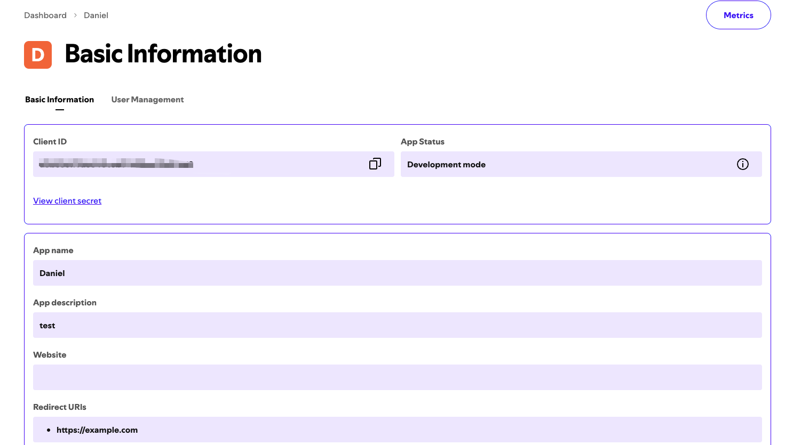
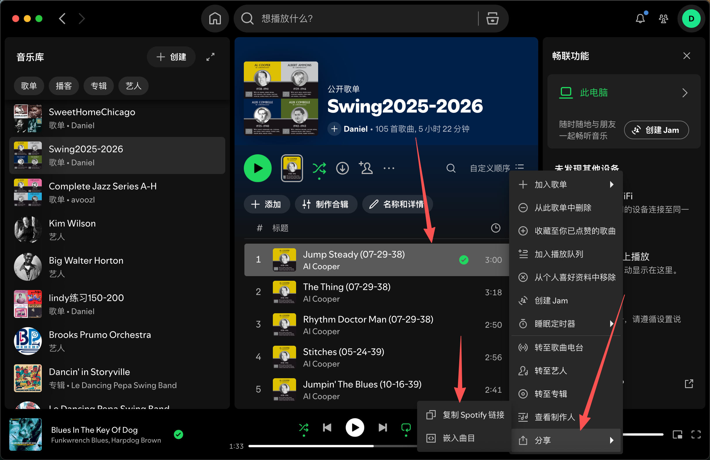

# SpotifyDL

当前版本：`0.2.0`

从 Spotify 单曲链接读取歌曲元数据，并通过 `yt-dlp` 在 YouTube 上搜索、下载音频，最后写入标题、艺人、专辑、年份、曲序和封面等标签。

> 仅供个人学习和研究使用。请遵守 Spotify、YouTube 及相关平台的服务条款和当地法律法规。当前 Web 版建议作为私有工具使用，不建议直接公开给任意用户访问。

## 当前状态

- 支持 CLI、批量脚本和简单 Web 页面。
- 当前可靠下载源是 `youtubemusic`，实际通过 `yt-dlp` 搜索 YouTube。
- `deezer`、`soundcloud`、`auto` 选项仍保留在代码中，但下载逻辑尚未完整实现。
- 支持单首或多首 Spotify track 链接；暂不支持 playlist/album 自动解析。

## 环境要求

- Python 3.10+
- FFmpeg（`yt-dlp` 转音频需要）
- Node.js 20.0.0+（推荐 Node.js 24 LTS 或更新 LTS，用于 YouTube 签名解析）

macOS 可用 Homebrew 安装 FFmpeg：

```bash
brew install ffmpeg
```

`yt-dlp` 和 PO Token 插件是 Python 依赖，执行 `pip install -e .` 时会自动安装。需要单独升级时可执行：

```bash
python -m pip install -U "yt-dlp[default]" bgutil-ytdlp-pot-provider
```

## 安装

```bash
python -m venv venv
source venv/bin/activate
pip install -e .
```

## 配置

在项目根目录创建 `.env`：

```dotenv
SPOTIFY_CLIENT_ID=your_spotify_client_id
SPOTIFY_CLIENT_SECRET=your_spotify_client_secret

# Web 版访问密码，部署到服务器时建议设置
SPOTIFYDL_WEB_PASSWORD=your_web_password

# 可选：备用 YouTube Cookies，仅在内容明确要求登录时使用
SPOTIFYDL_COOKIES_FILE=/path/to/cookies.txt

# 可选：PO Token Provider 地址；Docker Compose 会自动配置
SPOTIFYDL_POT_PROVIDER_URL=http://127.0.0.1:4416
```

获取 `SPOTIFY_CLIENT_ID` 和 `SPOTIFY_CLIENT_SECRET`：

1. 打开 [Spotify Developer Dashboard](https://developer.spotify.com/dashboard)，使用 Spotify 账号登录。
2. 点击 `Create app` 创建应用。
3. 进入应用详情页，复制 `Client ID` 和 `Client Secret`。
4. 将它们写入项目根目录的 `.env` 文件。

Spotify 官方说明见 [Apps | Spotify for Developers](https://developer.spotify.com/documentation/web-api/concepts/apps)。



## Web 版

启动本地 Web 服务：

```bash
source venv/bin/activate
python -m uvicorn spotifydl.web:app --host 127.0.0.1 --port 8000
```

打开 `http://127.0.0.1:8000`，粘贴一个或多个 Spotify track 链接后点击下载。任务完成后可以下载单首歌曲，也可以下载全部歌曲的 zip 包。

Web 版配置项：

- `SPOTIFYDL_WEB_PASSWORD`：访问密码。部署到公网服务器时建议设置。
- `SPOTIFYDL_WEB_MAX_LINKS`：单次最多链接数，默认 `10`。
- `SPOTIFYDL_WEB_TASK_TTL_SECONDS`：下载文件保留时间，默认 `86400` 秒。
- `SPOTIFYDL_WEB_WORKERS`：后台下载任务并发数，默认 `2`。
- `SPOTIFYDL_WEB_SOURCE`：下载源，默认 `youtubemusic`。
- `SPOTIFYDL_WEB_FORMAT`：输出格式，默认 `mp3`。
- `SPOTIFYDL_WEB_QUALITY`：音频质量，默认 `320k`。
- `SPOTIFYDL_COOKIES_FILE`：备用 YouTube Cookies 文件，仅在登录/年龄限制内容上重试一次。
- `SPOTIFYDL_POT_PROVIDER_URL`：PO Token Provider 地址；未设置时不启用 Provider。
- `SPOTIFYDL_CACHE_ENABLED`：是否复用已下载歌曲，默认 `true`。
- `SPOTIFYDL_CACHE_DIR`：缓存目录，默认 `web_cache/`。
- `SPOTIFYDL_CACHE_TTL_SECONDS`：缓存有效期，默认 `2592000` 秒（30 天）。
- `SPOTIFYDL_WEB_RATE_LIMIT_TRACKS`：每个客户端在限流窗口内允许提交的歌曲数，默认 `20`。
- `SPOTIFYDL_WEB_RATE_LIMIT_WINDOW_SECONDS`：限流窗口，默认 `3600` 秒。
- `SPOTIFYDL_YOUTUBE_MIN_INTERVAL_SECONDS`：歌曲下载启动的最小间隔，默认 `2` 秒。
- `SPOTIFYDL_YOUTUBE_MIN_MATCH_SCORE`：YouTube 候选最低匹配分，默认 `4`。
- `SPOTIFYDL_YOUTUBE_BREAKER_THRESHOLD`：连续风控错误的熔断阈值，默认 `3`。
- `SPOTIFYDL_YOUTUBE_BREAKER_COOLDOWN_SECONDS`：熔断冷却时间，默认 `900` 秒。

下载文件保存在 `web_downloads/`，缓存保存在 `web_cache/`，两个目录均已被 Git 忽略。同一首歌、格式和音质的并发请求只会实际下载一次。

YouTube 下载默认使用匿名请求。PO Token Provider 可用时会自动获取 Token；只有 yt-dlp 明确返回登录或年龄限制错误时，程序才使用备用 Cookies 重试一次。`403`、`429` 和机器人验证会触发限流/熔断，不会反复使用账号 Cookies。

如果页面提示无法连接 Web 服务或 `Failed to fetch`：

1. 确认服务正在运行。
2. 确认浏览器打开的是 `http://127.0.0.1:8000`，不要直接打开 HTML 文件。
3. 修改前端代码后刷新页面；必要时用浏览器强制刷新清理旧脚本缓存。

## Docker 部署

仓库中的 `docker-compose.yml` 会启动 Web 应用和 PO Token Provider。Provider 只在 Docker 内部网络开放，不映射到公网。

```bash
mkdir -p secrets
# 可选：需要下载登录受限内容时放置备用 Cookies
cp /path/to/cookies.txt secrets/youtube-cookies.txt
sudo chown root:10001 secrets secrets/youtube-cookies.txt
sudo chmod 750 secrets && sudo chmod 640 secrets/youtube-cookies.txt
docker compose up -d --build
```

服务默认监听服务器的 `8000` 端口。查看状态和日志：

```bash
docker compose ps
docker compose logs -f app pot-provider
```

监控系统或反向代理可请求 `GET /healthz`。当 PO Token Provider 不可用或 YouTube 熔断开启时，该接口返回 `503`；正常时返回 `200`。

备用 Cookies 失效时，直接替换服务器上的 `secrets/youtube-cookies.txt`。应用每次需要登录兜底时都会重新读取该文件，不需要重新构建镜像。替换后不要把 Cookies 提交到 Git。

## CLI 使用

```bash
spotifydl -u "https://open.spotify.com/track/..." -o "./music" -s youtubemusic
```

常用参数：

- `-u, --url`：Spotify 单曲链接，必填。
- `-o, --output`：输出目录，必填。
- `-f, --format`：输出格式，默认 `mp3`。
- `-q, --quality`：音频质量，默认 `320k`。
- `-s, --source`：音乐源，建议使用默认的 `youtubemusic`。
- `-c, --cookies`：YouTube cookies 文件路径。
- `--cookies-from-browser`：从浏览器读取 cookies，例如 `chrome`、`firefox`、`edge`、`safari`。

如何获取 Spotify 单曲链接：



如果内容明确要求登录或年龄验证，可使用浏览器 Cookies 作为一次性兜底：

```bash
spotifydl -u "https://open.spotify.com/track/..." -o "./music" --cookies-from-browser chrome
```

或指定 cookies 文件：

```bash
spotifydl -u "https://open.spotify.com/track/..." -o "./music" -c "/path/to/cookies.txt"
```

## 批量脚本

项目提供了 `batch_dl.sh` 作为批量下载模板。编辑脚本里的 `TRACK_URLS` 数组，每行放一个 Spotify track 链接：

```bash
TRACK_URLS=(
  "https://open.spotify.com/track/..."
  "https://open.spotify.com/track/..."
)
```

运行：

```bash
chmod +x batch_dl.sh
./batch_dl.sh
```

可通过环境变量覆盖输出目录和 cookies：

```bash
OUTPUT_DIR="./music" COOKIES_FROM_BROWSER=chrome ./batch_dl.sh
```

## 输出

下载完成后，文件名格式为：

```text
艺人 - 歌名.mp3
```

非法文件名字符会被替换为 `_`，同名文件会被覆盖。

## 许可证

MIT License
